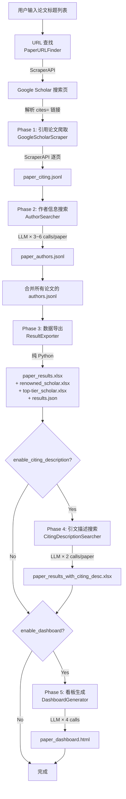

# CitationAgent — 执行流程与成本分析报告

> 生成时间: 2026-02-26
> 分析范围: 核心模块 12 个文件，全量代码阅读

## 1. 项目概览

| 属性 | 值 |
|---|---|
| 技术栈 | Python 3 + FastAPI + OpenAI SDK (兼容格式) + Playwright + BeautifulSoup4 + Pandas |
| 入口文件 | `start.py` → `app/main.py` |
| 核心模块数 | 7 (`url_finder`, `scraper`, `parser`, `author_searcher`, `exporter`, `citing_description_searcher`, `dashboard_generator`) |
| 外部服务依赖 | ScraperAPI (网页抓取代理)、OpenAI 兼容 LLM API (默认 Gemini via api.gpt.ge) |
| 配置文件 | `config.json` (Pydantic 管理，Web UI 可编辑) |

## 2. 执行流程

### 2.1 总体流程图



### 2.2 分阶段详述

#### URL 查找: `PaperURLFinder`
- **触发条件**: 每个输入论文标题，必定执行
- **输入**: 论文标题字符串
- **处理逻辑**: 通过 ScraperAPI 请求 Google Scholar 搜索页，BeautifulSoup 解析出 `cites=` 链接
- **输出**: `https://scholar.google.com/scholar?cites=XXXXX`
- **外部调用**: ScraperAPI × 1 (`url_finder.py:44`)
- **注意**: 同步阻塞调用，在 async 上下文中会阻塞事件循环

#### Phase 1: 引用论文爬取
- **触发条件**: 总是执行
- **输入**: Google Scholar cites URL
- **处理逻辑**: 逐页抓取引用论文列表(每页 10 条)，解析标题/链接/年份/引用数/作者主页
- **输出**: `paper_citing.jsonl`
- **外部调用**: ScraperAPI × (N/10 + 1) (`scraper.py:178`)
- **重试**: 三层重试机制(HTTP 重试 → 登录页检测重试 → 数据中心不一致重试)

#### Phase 2: 作者信息搜索
- **触发条件**: 总是执行
- **输入**: `paper_citing.jsonl`
- **处理逻辑**: 对每篇引用论文，通过 LLM 联网搜索获取作者信息、学术头衔、知名学者识别
- **输出**: `paper_authors.jsonl`
- **外部调用** (每篇引用论文):
  - `search_fn` (prompt1): 查作者和机构 (`author_searcher.py:163`, web_search) — **必定调用**
  - `format_fn`: 提取第一作者机构/国家 (`author_searcher.py:262`, JSON mode) — **必定调用**
  - `search_fn` (prompt2): 查作者引用数/头衔/奖项 (`author_searcher.py:163`, web_search) — **必定调用**
  - `verify_fn`: 验证作者信息 (`author_searcher.py:313`, web_search) — **仅 `enable_author_verification=True`**
  - `chat_fn`: 识别知名学者 (`author_searcher.py:213`, 无 web_search) — **仅 `enable_renowned_scholar_filter=True`**
  - `format_fn` × M: 格式化每个知名学者 (`author_searcher.py:262`, JSON mode) — **每识别一个学者调用一次**

#### Phase 3: 数据导出
- **触发条件**: 总是执行
- **输入**: 合并后的 `merged_authors.jsonl`
- **处理逻辑**: 纯 Python 数据处理，分类知名学者(院士/Fellow)，生成 Excel
- **输出**: `paper_results.xlsx`, `paper_all_renowned_scholar.xlsx`, `paper_top-tier_scholar.xlsx`, `paper_results.json`
- **外部调用**: 无 (零成本)

#### Phase 4: 引文描述搜索 (可选)
- **触发条件**: `enable_citing_description=True` (默认开启)
- **输入**: Phase 3 的 `paper_results.xlsx`
- **处理逻辑**: 对每篇引用论文，通过 LLM 联网搜索找到引用原文段落
- **输出**: `paper_results_with_citing_desc.xlsx`
- **外部调用** (每篇引用论文):
  - `_search_fn` (q1): 查目标论文的作者列表 (`citing_description_searcher.py:39`, web_search)
  - `_search_fn` (q2): 查引用论文中的引用描述 (`citing_description_searcher.py:39`, web_search)

#### Phase 5: 看板生成 (可选)
- **触发条件**: `enable_dashboard=True` (默认开启)
- **输入**: Phase 4 的 Excel + 知名学者 Excel
- **处理逻辑**: LLM 分析关键词/引文/趋势/洞察，组装自包含 HTML 报告
- **输出**: `paper_dashboard.html`
- **外部调用** (每次运行各 1 次):
  - `_llm`: 关键词分析 (`dashboard_generator.py:262`)
  - `_llm`: 引文描述分析 (`dashboard_generator.py:320`)
  - `_llm`: 趋势预测 (`dashboard_generator.py:399`)
  - `_llm`: 洞察卡片生成 (`dashboard_generator.py:503`)
- **全部有确定性 fallback**: 即使 LLM 失败也能生成完整看板

## 3. 规则链 (Decision Chain)

| # | 位置 | 条件 | 真分支 | 假分支 | 影响范围 |
|---|---|---|---|---|---|
| 1 | `task_executor.py:522` | `enable_citing_description` | 执行 Phase 4 (2×N 次 LLM) | 跳过 | Phase 4, Phase 5 输入 |
| 2 | `task_executor.py:540` | `enable_dashboard` | 执行 Phase 5 (4 次 LLM) | 跳过 | 看板生成 |
| 3 | `author_searcher.py:412` | `enable_author_verification` | 每篇论文多 1 次 LLM (verify_fn) | 跳过 | 作者数据质量 |
| 4 | `author_searcher.py:418` | `enable_renowned_scholar` | 每篇论文多 1+M 次 LLM | 跳过 | 知名学者识别 |
| 5 | `scraper.py:861` | `enable_year_traverse` | 按年份逐年爬取(绕过 1000 限制) | 普通分页爬取 | Phase 1 爬取策略 |
| 6 | `scraper.py:472-488` | 登录页检测 (real_count) | 重试(轮换 session + API key) | 继续解析 | 爬取可靠性 |
| 7 | `scraper.py:725` | 数据中心不一致检测 | 重试(轮换 country_code) | 继续 | 数据完整性 |
| 8 | `scraper.py:170-176` | `scraper_premium` / `ultra_premium` | ScraperAPI 高级代理 | 标准代理 | 爬取成本 |
| 9 | `dashboard_generator.py:263+` | LLM 返回有效 JSON | 使用 LLM 分析结果 | 使用确定性 fallback | 看板数据质量 |

## 4. 成本地图 (Cost Map)

### 4.1 外部调用汇总

设 N = 引用论文总数，M = 每篇论文中识别到的知名学者数(通常 0-3)

| 服务 | 调用位置 | 触发条件 | 频次/每次运行 | 模型 |
|---|---|---|---|---|
| ScraperAPI | `url_finder.py:44` | 必定 | 每个输入标题 × 1 | - |
| ScraperAPI | `scraper.py:178` | 必定 | ⌈N/10⌉ + 1 (检测页) | - |
| LLM (web_search) | `author_searcher.py:163` prompt1 | 必定 | N | `openai_model` |
| LLM (JSON) | `author_searcher.py:262` format | 必定 | N | `renowned_scholar_model` |
| LLM (web_search) | `author_searcher.py:163` prompt2 | 必定 | N | `openai_model` |
| LLM (web_search) | `author_searcher.py:313` verify | `enable_author_verification` | 0 或 N | `author_verify_model` |
| LLM (无搜索) | `author_searcher.py:213` chat | `enable_renowned_scholar` | 0 或 N | `renowned_scholar_model` |
| LLM (JSON) | `author_searcher.py:262` format | `enable_renowned_scholar` | 0 或 N×M | `renowned_scholar_model` |
| LLM (web_search) | `citing_description_searcher.py:39` q1 | `enable_citing_description` | 0 或 N | `openai_model` |
| LLM (web_search) | `citing_description_searcher.py:39` q2 | `enable_citing_description` | 0 或 N | `openai_model` |
| LLM (无搜索) | `dashboard_generator.py:262` | `enable_dashboard` | 0 或 1 | `dashboard_model` |
| LLM (无搜索) | `dashboard_generator.py:320` | `enable_dashboard` | 0 或 1 | `dashboard_model` |
| LLM (无搜索) | `dashboard_generator.py:399` | `enable_dashboard` | 0 或 1 | `dashboard_model` |
| LLM (无搜索) | `dashboard_generator.py:503` | `enable_dashboard` | 0 或 1 | `dashboard_model` |

### 4.2 成本公式

```
最小成本 (所有可选项关闭):
  ScraperAPI: ⌈N/10⌉ + 2 次请求
  LLM: 3N 次调用 (2次 web_search + 1次 JSON)

默认配置 (renowned_scholar=ON, citing_desc=ON, dashboard=ON):
  ScraperAPI: ⌈N/10⌉ + 2 次请求
  LLM: 3N + N + N×M + 2N + 4 = (5+M)×N + 4 次调用
  其中 web_search 调用: 2N + 2N = 4N 次
  无搜索调用: N + N×M + N + 4 = (2+M)×N + 4 次

最大配置 (所有选项开启):
  ScraperAPI: ⌈N/10⌉ + 2 次请求
  LLM: 3N + N + N + N×M + 2N + 4 = (6+M)×N + 4 次调用

示例 (N=100 篇引用论文, M≈1 平均每篇1个知名学者):
  最小: 300 次 LLM + 12 次 ScraperAPI
  默认: ~604 次 LLM + 12 次 ScraperAPI
  最大: ~704 次 LLM + 12 次 ScraperAPI
```

### 4.3 成本分布 (默认配置, N=100)

```
Phase 2 (作者搜索):      ██████████████████████████████ 50%  (300 次, 含 web_search)
Phase 4 (引文描述):      ████████████████████           33%  (200 次, 全部 web_search)
Phase 2 (知名学者识别):  ████████                       13%  (~100 次, 无搜索)
Phase 5 (看板):          ▎                               1%  (4 次, 无搜索)
Phase 1 (爬取):          █                                2%  (12 次 ScraperAPI)
Phase 0 (URL查找):       ▎                               1%  (1 次 ScraperAPI)
```

**关键发现: Phase 2 + Phase 4 占总成本的 96%，且全部是逐篇论文的 LLM 调用。**

## 5. 优化建议

### 高优先级 (High Impact, Easy)

#### 5.1 Phase 4 重复查询目标论文作者 — 节省 N 次 LLM 调用

- **问题**: `citing_description_searcher.py:59` 每篇引用论文都调用 LLM 搜索"目标论文的所有作者"，但这些作者信息在所有引用论文中完全相同，且目标论文的作者通常在初始输入或 Phase 2 结果中已经存在。
- **建议**: 将目标论文的作者查询移到循环外，只查一次，或直接从已有数据中读取。
- **预估节省**: N 次 web_search LLM 调用 ≈ **总成本的 17%**
- **实现难度**: 低
- **涉及文件**: `core/citing_description_searcher.py`

#### 5.2 `format_fn` 重试 bug — 调错了函数

- **问题**: `author_searcher.py:284,292` 的 `format_fn` 在重试时调用 `self.chat_fn()` 而非 `self.format_fn()`，导致重试时丢失 `response_format={"type": "json_object"}`，可能返回非 JSON 格式导致下游解析失败。
- **建议**: 将 `self.chat_fn(...)` 改为 `self.format_fn(..., retry_count=retry_count+1)`。
- **预估节省**: 避免因格式错误导致的级联重试和数据丢失
- **实现难度**: 低
- **涉及文件**: `core/author_searcher.py`

#### 5.3 Rate-limit 重试无限递归 — 潜在死循环

- **问题**: `author_searcher.py` 的 4 个 LLM 函数在遇到 rate/quota 错误时使用递归重试且 `retry_count` 不递增（如 `search_fn:184-185`），可能导致无限循环和无限等待。
- **建议**: 设置最大 rate-limit 重试次数（如 10 次），超出后返回错误。
- **实现难度**: 低
- **涉及文件**: `core/author_searcher.py`

#### 5.4 删除死代码

- **问题**: `core/author_searcher_legacy.py` 和 `core/author_searcher_new.py.bak` 无任何引用，为完全无用的死文件。
- **建议**: 删除。
- **实现难度**: 低

### 中优先级 (Medium Impact)

#### 5.5 LLM 调用函数重复代码 — 4 个近乎相同的函数

- **问题**: `author_searcher.py` 中 `search_fn`、`chat_fn`、`format_fn`、`verify_fn` 约 200 行代码为 copy-paste，仅模型名、`extra_body`、`response_format` 不同。
- **建议**: 抽取为一个通用 `_call_llm(model, messages, web_search=False, json_mode=False)` 方法。
- **预估节省**: 减少 ~150 行代码，降低 bug 概率（如 5.2 的 bug 就是 copy-paste 导致的）
- **实现难度**: 中
- **涉及文件**: `core/author_searcher.py`

#### 5.6 `url_finder.py` 同步阻塞 async 事件循环

- **问题**: `url_finder.py` 使用同步 `requests.get` + `time.sleep`，在 `execute_for_titles` (async) 中调用时阻塞整个事件循环。
- **建议**: 改用 `httpx.AsyncClient` 或用 `asyncio.to_thread()` 包装。
- **实现难度**: 中
- **涉及文件**: `core/url_finder.py`, `app/task_executor.py`

#### 5.7 Phase 2 知名学者识别可用规则替代部分 LLM 调用

- **问题**: `chat_fn` 调用 LLM 判断学者是否"知名"，但 Phase 3 的 `exporter.py` 中已有基于关键词的分类规则（院士/Fellow 匹配）。Phase 2 的 LLM 判断和 Phase 3 的规则判断存在功能重叠。
- **建议**: 评估是否可以仅保留 Phase 3 的规则判断，将 Phase 2 的 `chat_fn` 改为仅在 Phase 3 规则无法判断时触发。
- **预估节省**: 可能节省 N 次 LLM 调用 ≈ **总成本的 17%**
- **实现难度**: 中（需评估 LLM 判断是否提供了规则无法覆盖的价值）
- **涉及文件**: `core/author_searcher.py`, `core/exporter.py`

#### 5.8 Phase 5 四个 LLM 调用可并行执行

- **问题**: `dashboard_generator.py` 的 4 个 LLM 调用是同步顺序执行的，且使用同步 `OpenAI` 客户端。
- **建议**: 改用 `AsyncOpenAI` 并用 `asyncio.gather` 并行执行 4 个调用。
- **预估节省**: 从 4×延迟 降为 1×延迟（Phase 5 生成速度提升约 4 倍）
- **实现难度**: 中
- **涉及文件**: `core/dashboard_generator.py`

### 低优先级 (Low Impact or Hard)

#### 5.9 `task_executor.py` 重复的对象构造代码

- **问题**: `AuthorSearcher` 在 3 个方法中各实例化一次，11 个构造参数完全 copy-paste。`GoogleScholarScraper` 同理。
- **建议**: 抽取 `_create_author_searcher(config)` 和 `_create_scraper(config)` 工厂方法。
- **实现难度**: 低
- **涉及文件**: `app/task_executor.py`

#### 5.10 `dashboard_generator._build_html` 方法过长 (679 行)

- **问题**: 单个方法 679 行，全部用字符串拼接生成 HTML/CSS/JS，难以维护和调试。
- **建议**: 拆分为子方法（`_build_header`, `_build_charts`, `_build_scholar_table` 等），或使用 Jinja2 模板。
- **实现难度**: 高（纯重构工作量大）
- **涉及文件**: `core/dashboard_generator.py`

#### 5.11 Phase 5 `_llm` 无重试逻辑

- **问题**: `dashboard_generator.py:34` 的 `_llm` 方法在异常时直接返回空字符串，无任何重试。虽然有 fallback，但一次网络抖动就触发 fallback 降低了报告质量。
- **建议**: 添加简单的 1-2 次重试。
- **实现难度**: 低
- **涉及文件**: `core/dashboard_generator.py`

## 6. 冗余代码

| 文件 | 行数 | 说明 | 建议 |
|---|---|---|---|
| `core/author_searcher_legacy.py` | 全部 (~180行) | 旧版同步实现，无任何引用 | 删除 |
| `core/author_searcher_new.py.bak` | 全部 | 备份文件，无引用 | 删除 |
| `author_searcher.py:145-345` | ~200行 | 4 个 LLM 函数 80% 重复 | 合并为通用方法 |
| `task_executor.py` 多处 | ~60行 | AuthorSearcher/Scraper 重复构造 | 抽取工厂方法 |
| `citing_description_searcher.py:21-30` | ~10行 | AsyncOpenAI 初始化与 author_searcher 重复 | 可抽取公共基类 |

## 7. 总结

| 指标 | 值 |
|---|---|
| 总外部调用类型 | 14 种 (12 种 LLM + 2 种 ScraperAPI) |
| 可选(可关闭)调用占比 | ~55% (Phase 4 的 2N + Phase 2 verify N + renowned N+NM + Phase 5 的 4) |
| 最大可节省成本 (高优先级) | **~17%** (消除 Phase 4 重复的目标论文作者查询) |
| 潜在可节省成本 (含中优先级) | **~34%** (如果知名学者识别改为规则优先) |
| 高优先级优化项 | 4 项 (含 2 个 bug 修复) |
| 中优先级优化项 | 4 项 |
| 冗余/死代码 | ~450 行可清理 |
| Bug | 2 个 (`format_fn` 重试调错函数 + rate-limit 无限递归) |
