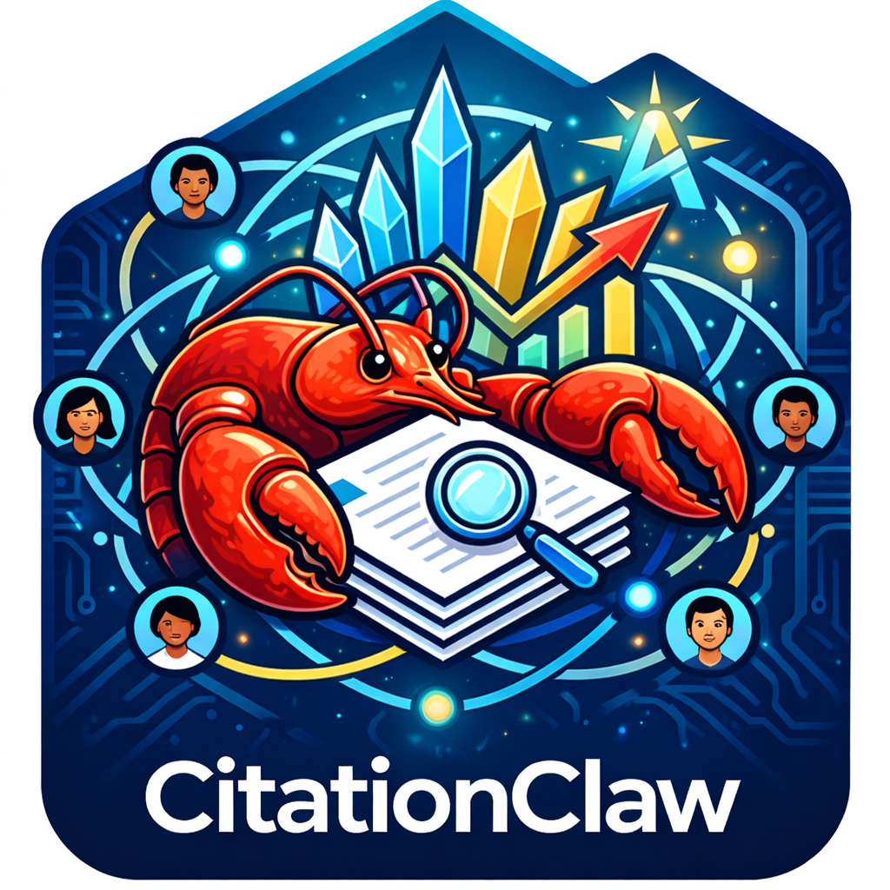

<div align="center">
  <br>

# CitationClaw — 论文被引画像分析智能体

  [](https://visionxlab.github.io/CitationClaw/)
  
  
  
  
  

**输入论文题目或者从谷歌学术主页选择论文，一键获得完整的被引分析报告。**<br>
自动爬取所有施引文献、识别引用学者背景，最终生成一份精美的可视化 HTML 画像报告，用于了解自己/他人的被引情况。

</div>

---

## 更新日志

| 日期 | 版本 | 更新内容 |
|------|------|---------|
| 2026-03-12 | v1.0 | 🎉 首次公开发布：支持论文题目输入与 Google Scholar 批量导入、五种分析层级、著名学者自动识别、可视化 HTML 画像报告、断点续爬与缓存复用 |

---

## 快速导览

| 文档                                                                                 | 说明 |
|------------------------------------------------------------------------------------|------|
| [📊 画像报告示例①](https://visionxlab.github.io/CitationClaw/demo1.html)           | 真实输出样例，点击即可在线预览最终报告效果 |
| [📊 画像报告示例②](https://visionxlab.github.io/CitationClaw/demo2.html)           | 另一篇真实论文的被引画像报告 |
| [📖 深度使用报告](https://visionxlab.github.io/CitationClaw/use-report.html)       | 一位用户用 CitationClaw 分析自己论文被引情况的完整体验记录 |
| [🔧 技术架构报告](https://visionxlab.github.io/CitationClaw/technical-report.html) | 系统架构、核心模块与实现细节，适合开发者或希望深入了解原理的读者 |

---

## 安装

需要 **Python 3.10 及以上版本（推荐Python 3.12）**。

```bash
pip install -r requirements.txt
python start.py
```

启动后访问 [http://127.0.0.1:8000](http://127.0.0.1:8000)。

---

## 使用流程

### 第一步：配置 API（首次使用）

展开页面上的「API 配置」，填写：

| 字段                                                              | 说明                                                                |
|-----------------------------------------------------------------|-------------------------------------------------------------------|
| **两个API Key 必填**⬇️                                              |                                                                   |
| **ScraperAPI Key** [前往获取](https://dashboard.scraperapi.com)     | 用于抓取 Google Scholar。（ScraperAPI对于免费账户有1000积分试用，可供爬取50次）           |
| **LLM API Key** [推荐V-API](https://api.gpt.ge/register?aff=qH2n) | 支持任意 OpenAI 兼容格式的 API Key                                         |
| **其他配置 选填**⬇️                                                   | |
| **Base URL**                                                    | API 服务地址（默认使用V-API） `https://api.gpt.ge/v1/`                      |
| **Search Model**                                                | **必须具备实时 web search 能力**（推荐V-API） `gemini-3-flash-preview-search` |
| **Dashboard Model**                                             | 生成报告专用，无需 search 能力（推荐V-API） `gemini-3-flash-preview-nothinking`  |

### 第二步：填写要分析的论文

支持两种方式输入论文：

**方式 A：直接输入题目**

在文本框中每行填写一篇论文的完整英文题目，支持同时分析多篇。可为某篇论文添加曾用名（如预印本），系统自动合并：

```
Attention Is All You Need
BERT: Pre-training of Deep Bidirectional Transformers for Language Understanding
```

**方式 B：从 Google Scholar 学者主页导入**

粘贴任意学者的 Google Scholar 主页 URL，系统自动获取该学者的全部论文列表，勾选感兴趣的论文后一键导入，无需手动复制题目：

```
https://scholar.google.com/citations?user=xxxxxx
```

### 第三步：选择分析层级

| 层级             | 适用场景 |
|----------------|---------|
| **全面版（默认，推荐）** | 完整分析，对所有施引文献查找引用原句 |
| **进阶版**        | 施引文献多时推荐，仅对院士/Fellow 查找引用原句 |
| **标准版**        | 只需学者画像和统计图表，不需要引用原文 |
| **指定学者版**      | 快速查询某几位学者是否引用了目标论文 |
| **学者查证版**      | 核实特定学者引用情况，明确给出匹配/未匹配报告 |


### 第四步：获取报告

分析完成后，直接下载 **`paper_dashboard.html`**，用浏览器打开即可——无需服务器，单文件，直接分享。

---

## 画像报告包含什么

生成的 HTML 报告是本工具的核心产出，一份报告涵盖：

- **关键词云**：从施引文献标题中提取高频词，附中文翻译，直观呈现研究热点
- **引用趋势预测**：历年引用量柱状图，含 LLM 分析预测和线性回归双路径预测
- **国家/地区分布**：施引文献第一作者的国家分布，一眼看出国际影响力
- **著名研究机构分布**：是否有国内外著名研究机构引用（Google, DeepMind, OpenAI, 阿里, 腾讯, 字节等）
- **著名学者画像**：院士、Fellow、杰青等重量级学者的详细列表，可展开查看其引用原句及所在章节（引言/相关工作/方法/实验），支持 Markdown 渲染
- **引用位置与情感分析**：引用出现在哪个章节的分布，以及正面/中性引用比例
- **综合 Insight**：LLM 自动生成的四维结构化总结——引用规模与分布、主要用途、代表性原文摘录、综合说明

---

## 核心功能

**著名学者自动识别与高亮**
自动识别中国科学院/工程院院士、其他国家院士、IEEE/ACM/ACL 等学会 Fellow、国家杰青/长江学者等，在报告和 Excel 中颜色标注，重要引用一目了然。

**自引检测与排除**
自动比对施引论文与目标论文的作者列表，精准识别自引（考虑姓名缩写、别名等情况），并在著名学者分析和画像报告中自动排除，让数据更客观可信。

**突破千篇限制**
Google Scholar 每个引用列表最多只显示 1000 篇。开启「年份遍历模式」后，系统按年份分段爬取并合并去重，高被引论文（如 Transformer、BERT）同样可获取完整数据。

**断点续爬**
任务中断后，设置 `resume_page_count` 为中断页码，重新启动即可从断点继续，已消耗的 ScraperAPI 额度不会浪费。

**作者信息持久缓存**
已搜索过的学者信息自动缓存复用，多次分析包含相同施引文献的论文无需重复调用 LLM，大幅降低费用。

---

## 其他输出文件

除 HTML 报告外，每次分析还会在 `data/result-{时间戳}/` 中生成：

- `paper_results.xlsx`：全部施引论文 + 作者信息，著名学者行颜色标注
- `paper_results_all_renowned_scholar.xlsx`：著名学者引用汇总
- `paper_results_with_citing_desc.xlsx`：含引用原句的增强版表格
- `paper_results.json`：结构化 JSON，便于程序处理

如需基于已有数据重新生成 HTML 报告，无需重新爬取：

```bash
python core/dashboard_test.py data/result-{时间戳}/paper_results.xlsx
```

---

## 常见问题

**作者信息出现错误或 LLM 编造内容**
搜索模型必须具备实时 **web search** 能力，否则 LLM 会基于训练数据编造学者信息。推荐使用 `gemini-3-flash-preview-search` 或同类带 search 的模型。

**ScraperAPI 请求频繁失败**
检查 Key 是否有效、额度是否充足。建议配置 3 个以上 Key 轮换；引用数多的论文爬取耗时较长，属正常现象。

**引用数超过 1000 篇，数据不完整**
在配置页开启「年份遍历模式」（`enable_year_traverse`）。

**任务中断后如何继续**
在配置页将 `resume_page_count` 设为中断时的页码，重新启动即可。

**HTML 报告未生成**
确认已启用「著名学者筛选」（`enable_renowned_scholar_filter`），Dashboard 依赖此数据。

---

## 社区与动态

### 即将上线

CitationClaw 的更完善版本即将在 **[减论](https://www.reduct.cn/)** 上线，提供更强大的功能与更流畅的使用体验，敬请期待！

### 用户交流群（可供人工代查）

欢迎扫码加入用户群，获取最新动态、交流使用心得、人工代查：

<div align="center">
  
</div>

---

## 免责声明

本项目仅供学术研究和个人学习使用。请遵守 Google Scholar 服务条款及当地法律法规，避免高频大规模抓取。ScraperAPI 的使用须遵守其服务条款。作者不对使用本工具产生的任何后果负责。

---

## Star 趋势

<div align="center">

[](https://star-history.com/#VisionXLab/CitationClaw&Date)

</div>

---

**开发者**：Qihao Yang, Ziqian Fan, Xue Yang (Project Leader)
**单位**：上海交通大学
**版本**：1.0
**更新日期**：2026-03-12
