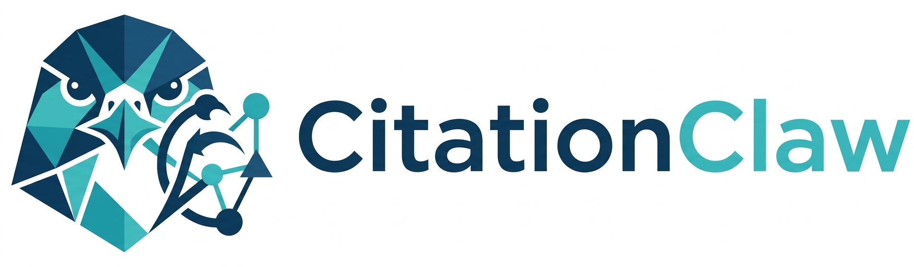

<div align="right">

English | [中文](./README.zh-CN.md)

</div>

<div align="center">
  <br>

# CitationClaw: A Lightweight Engine for Discovering Scientific Impact through Citations
# CitationClaw v2 is coming soon, stay tuned!

让每一次引用都成为可解释的影响力  
<em>Turning Every Citation into Explainable Impact</em>

[](https://visionxlab.github.io/CitationClaw/)
[](https://pypi.org/project/citationclaw/)
[](https://pypi.org/project/citationclaw/)
[](https://github.com/VisionXLab/CitationClaw)
[](https://github.com/VisionXLab/CitationClaw/pulls)
[](https://github.com/VisionXLab/CitationClaw/issues)


[](https://creativecommons.org/licenses/by-nc/4.0/)

**Turn Every Citation into Explainable Impact.**  
Input paper titles (or import from Google Scholar profiles), and generate a full citation portrait report in minutes.

</div>

> ## 🚀 Contribute with PRs
> CitationClaw is community-driven and PR-friendly.
>
> - Open an issue: <https://github.com/VisionXLab/CitationClaw/issues>
> - Submit a PR: <https://github.com/VisionXLab/CitationClaw/pulls>
> - Good first tasks: docs, UI polish, skill metadata, retry robustness

## 📢 News

- **2026-03-18**: Released **beta v1.0.9** — Multi-paper dashboard dedup fix (title-based dedup key, correct KG edges); year-traverse no longer persisted across sessions; default parallel workers raised to 10; V-API Key registration link added; timeout log messages during LLM retries; SCOPE section scrollable with expand button; cache write throttling (every 10 items) to prevent large-file slowdowns.
- **2026-03-12**: Released **v1.0** — first public release.

## Key Features

- 🧠 **Five-Phase Citation Pipeline**: crawl -> author intelligence -> export -> citing description -> dashboard.
- 🎯 **Renowned Scholar Focus**: auto-identifies high-impact scholars and generates dedicated outputs.
- ⚡ **Tiered Analysis Modes**: Basic / Advanced / Full for speed-cost-depth tradeoff.
- 🔁 **Resumable + Cache-Aware**: supports resume-by-page, author cache, and citing-description cache.
- 📊 **Shareable HTML Report**: standalone dashboard file, no extra server needed for viewing.
- 🧩 **Skills Runtime Inside**: keeps five-phase logic while moving execution to modular skills.

## 🏗️ Architecture

CitationClaw keeps deterministic business phases while using a skills-style runtime for orchestration.

```text
UI/REST/WebSocket
      │
      ▼
TaskExecutor (Orchestrator)
      │
      ▼
Skills Runtime
  ├─ phase1_citation_fetch
  ├─ phase2_author_intel
  ├─ phase3_export
  ├─ phase4_citation_desc
  └─ phase5_report_generate
```

More details: [Technical Report](https://visionxlab.github.io/CitationClaw/technical-report.html)

## Table of Contents

- [News](#-news)
- [Key Features](#key-features)
- [Architecture](#️-architecture)
- [Install](#-install)
- [Quick Start](#-quick-start)
- [Configuration Highlights](#️-configuration-highlights)
- [Project Structure](#-project-structure)
- [Outputs](#-outputs)
- [Contribute & Roadmap](#-contribute--roadmap)
- [Community](#-community)
- [Star History](#-star-history)
- [Disclaimer](#️-disclaimer)

## 📦 Install

Requires **Python 3.10+** (Python 3.12 recommended).

### Install from PyPI (recommended)

```bash
pip install citationclaw
citationclaw                  # default: 127.0.0.1:8000
citationclaw --port 8080      # custom port
```

### Install from source

```bash
git clone https://github.com/VisionXLab/CitationClaw.git
cd CitationClaw
pip install -r requirements.txt
python start.py               # default: 127.0.0.1:8000
python start.py --port 8080
```

## 🚀 Quick Start

For first-time users, follow the complete guide with screenshots:

- [Quick Start (online)](https://visionxlab.github.io/CitationClaw/guidelines.html#installation)
- [Quick Start (local file)](./docs/guidelines.html#installation)

## 🤖 Agent / MCP Usage

CitationClaw also provides a headless adapter for Codex, MCP clients, and other agents:

```bash
citationclaw-agent validate-config --request request.json --pretty
citationclaw-agent run --request request.json --pretty
citationclaw-agent list-results --data-dir data --pretty
```

If console scripts are not on `PATH`, use `python3 -m citationclaw.agent_cli` with the same subcommands.

For MCP support:

```bash
pip install "citationclaw[agent]"
python3 -m citationclaw.mcp_server
```

See [Agent Usage](./docs/agent-usage.md) for request examples, environment variables, offline smoke tests, and the Codex plugin/skill surface.

## ⚙️ Configuration Highlights

- **Required keys**:
  - `ScraperAPI Key(s)` for Google Scholar crawling
  - `OpenAI-compatible API Key` for LLM-based analysis
- **Recommended search model**:
  - Keep `gemini-3-flash-preview-search` for search-capable stages
- **Service tiers**:
  - `Basic`: lower cost and faster for first runs
  - `Advanced`: citing descriptions for renowned-scholar papers only
  - `Full`: citing descriptions for all citing papers
- **For papers with >1000 citations**:
  - Enable year traverse mode

## 📁 Project Structure

```text
citationclaw/
├── app/                 # FastAPI app, task orchestration, config, logs
├── core/                # scraping / search / export / dashboard engines
├── skills/              # skills runtime and five phase skills
├── static/              # frontend assets
├── templates/           # Jinja2 pages
docs/                    # docs and demos
test/                    # tests
```

## 📤 Outputs

Each run creates a timestamped folder under `data/result-{timestamp}/`, usually including:

- `paper_results.xlsx`
- `paper_results_all_renowned_scholar.xlsx`
- `paper_results_top-tier_scholar.xlsx`
- `paper_results_with_citing_desc.xlsx`
- `paper_results.json`
- `paper_dashboard.html`

## 🤝 Contribute & Roadmap

PRs are welcome and appreciated.

Suggested directions:

- richer skill metadata and registry conventions
- stronger retry and network-failure resilience
- dashboard readability and UX improvement
- tests for pipeline contracts and compatibility
- provider/model compatibility presets

Useful links:

- Issues: <https://github.com/VisionXLab/CitationClaw/issues>
- Pull Requests: <https://github.com/VisionXLab/CitationClaw/pulls>
- Guidelines: <https://visionxlab.github.io/CitationClaw/guidelines.html>

## 🌍 Community

- Product update: [减论 reduct.cn](https://www.reduct.cn/)
- User group (CN):

<div align="center">
  
</div>

- If the group is full, add the personal WeChat below and we will invite you:

<div align="center">
  
</div>

## ⭐ Star History

<div align="center">

[](https://star-history.com/#VisionXLab/CitationClaw&Date)

</div>
